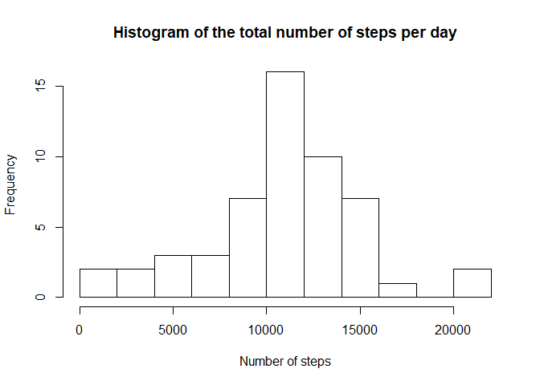
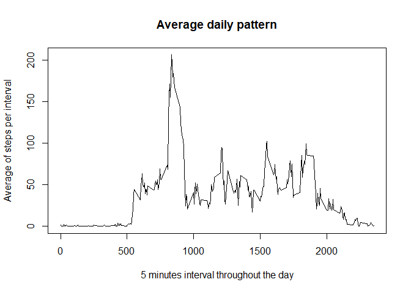
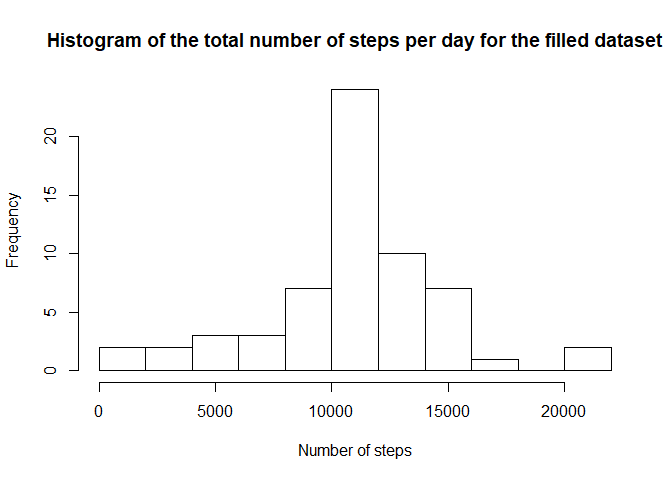

## Loading and preprocessing the data

1. Load the data (i.e. read.csv())


```r
unzip("activity.zip")
activity <- read.csv("activity.csv")
```

2. Process/transform the data (if necessary) into a format suitable for your analysis

I use the dplyr to preprocess and process the data.

The date observations are converted from a class "factor" to a class "date", useful in time series.


```r
library(dplyr)
```

```
## 
## Attaching package: 'dplyr'
```

```
## The following objects are masked from 'package:stats':
## 
##     filter, lag
```

```
## The following objects are masked from 'package:base':
## 
##     intersect, setdiff, setequal, union
```

```r
activity <- mutate(activity, date = as.Date(date))
```

## What is mean total number of steps taken per day?

1. Calculate the total number of steps taken per day


```r
totalStep <- activity %>%
  group_by(date) %>%
  summarize(total = sum(steps))
```

2. Histogram of total steps per day


```r
hist(totalStep$total, breaks = 15, main = "Histogram of the total number of steps per day", xlab = "Number of steps")
```

<!-- -->

3. Calculate the mean and median of the total number of steps taken per day


```r
mean <- mean(totalStep$total, na.rm = TRUE)
median <- median(totalStep$total, na.rm = TRUE)
```

The mean of total number of steps taken per day is **1.0766189\times 10^{4}** and the median is **10765**

## What is the average daily activity pattern?

1. Time series


```r
intervals <- activity %>%
  group_by(interval) %>%
  summarize(meanStepsPerDay = mean(steps, na.rm = TRUE))
plot(x = intervals$interval, y = intervals$meanStepsPerDay, type = "l", main = "Average daily pattern", xlab = "5 minutes interval throughout the day", ylab = "Average of steps per interval")
```

<!-- -->
  
2. Maximum number of steps


```r
maxStep <- intervals[which.max(intervals$meanStepsPerDay),1]
```

The 5-min interval with the highest number of steps across the average of all days is **835**

## Imputing missing values

1. Total number of NA values


```r
NumNA <- sum(is.na(activity))
```

They are **2304** NAs is the activity dataset

2. Missing value strategies

Missing values in intervals will be replaced by the corresponding  5-min interval average.

3. New dataset with filled missing values

I use a for loop to check every line of the activity dataset to check if there is a missing value. For every missing value I get which interval is missing and I fill it the the average step of the corresponding interval.


```r
activityFilled <- activity
for (i in 1:nrow(activityFilled)) {
  if (is.na(activityFilled[i,1])) {
    interval <- activityFilled[i,3]
    activityFilled[i,1] <- intervals[which(intervals$interval == interval),2]
  }
}
```

4. Comparing the origin dataset with the filled dataset

Computing the total step per day for the filled dataset


```r
totalStepFilled <- activityFilled %>%
  group_by(date) %>%
  summarize(total = sum(steps))
```


Histogram of the filled dataset


```r
hist(totalStepFilled$total, breaks = 15, main = "Histogram of the total number of steps per day for the filled dataset", xlab = "Number of steps")
```

<!-- -->

Calculate the mean and median of the total number of steps taken per day


```r
meanFilled <- mean(totalStepFilled$total, na.rm = TRUE)
medianFilled <- median(totalStepFilled$total, na.rm = TRUE)
data.frame(means = c(mean, meanFilled), medians = c(median, medianFilled), row.names = c("Original", "Filled"))
```

```
##             means  medians
## Original 10766.19 10765.00
## Filled   10766.19 10766.19
```

The difference between the two datasets is negligable, at least when looking at the means and the medians.


## Are there differences in activity patterns between weekdays and weekends?

1. Creating a new dataset with weekday factors


Creating a new column and filling with "weekday". Running a loop and if the weekdays happens to be a weekend, changing the value to "weekend" Please not that my system is in french. Finally converting to factor.


```r
activityFilledWeek <- mutate(activityFilled, week = "weekday")
for (i in 1:nrow(activityFilledWeek)) {
  weekday <- weekdays(activityFilledWeek[i,2])
  if (weekday == "samedi" | weekday == "dimanche") {
    activityFilledWeek[i,4] = "weekend"
  }
}
activityFilledWeek$week <- as.factor(activityFilledWeek$week)
```

2. Creating the plot


```r
library(lattice)

intervalsFilledWeek <- activityFilledWeek %>%
  group_by(interval, week) %>%
  summarize(meanStepsPerTypeOfDay = mean(steps))

xyplot(meanStepsPerTypeOfDay ~ interval | week, data = intervalsFilledWeek, layout = c(1,2), type = "l", main = "Average daily pattern comparison between weekday and weekend", xlab = "5-min intervals", ylab = "Average number of steps")
```

<!-- -->
